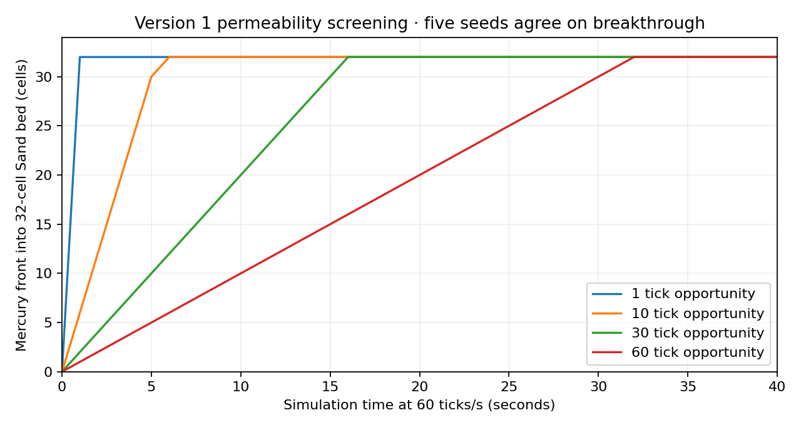

# Issue #10: granular exchange and sampled player acceptance

Date: 2026-09-09. This dated record covers the implementation of
[issue #10](https://github.com/techrote/cybersand/issues/10), separately from
[issue #9's preserved baseline](2026-09-09-physics-characterisation.md) and #11's
barrel feedback, bearing and barrier-aware ejection work.

## Source and runtime identity

Intake was `10e8153064f64272680696cce2b830791ecad2c3` on
`codex/issue-9-physics-characterisation`. The only dirty path was the intentional
Windows diagnostic DLL. Its bytes were preserved at
`C:/kybersand/validation/local/2026-09-09-issue-10/intake/issue-9-diagnostic.windows.x86_64.dll`,
SHA-256 `45f4ba78787a9e2d4daefb9b3ba24b1e476cb496343f63e77dd75a3e1c712eb7`.
The companion workspace was clean. No unrelated work or functional deliverable
under `C:/cybersand` was changed.

The local implementation branch is `codex/issue-10-player-and-exchange`.
Support commit `1fba848bd2b624ec99974ffa896e34e01c39575e` precedes the separate
exchange/evidence commit. The final
[runtime manifest](issue-10-2026-09-09/runtime-manifest.json) records that support
HEAD plus source delta, combined source SHA-256
`2b61d5a357642c787c98ac64f568ee40235b56c5cf51aa0a107d7767600cecaa`.
Raw `runtime-final-reset/` also retains the tracked patch and changed/new source files.
Later documentation/reducer edits do not alter runtime inputs.

All raw paths below are relative to
`C:/kybersand/validation/local/2026-09-09-issue-10/`. Per-series snapshots are
[native](issue-10-2026-09-09/native-manifest.json),
[permeability](issue-10-2026-09-09/permeability-manifest.json),
[all liquid pairs](issue-10-2026-09-09/pairs-manifest.json) and
[player](issue-10-2026-09-09/player-manifest.json). Source tooling, tests and
curated evidence are committed; generated runtimes and raw logs are not.

| Rebuilt artifact | SHA-256 |
|---|---|
| Windows native DLL | `d363cadf71674eab72df54c154bac3aeccbfaa63884c8c3a6b92fe585e1039eb` |
| Native characterisation CLI | `29ea0af719ef686d96fe320301e4ef050f7c63092056f1143dff6df7bd0e69ad` |
| Compatibility native WASM | `1dcfd724346f791c331f405fe1d0cf52638885755d578ad3a830a0aaa15d2900` |
| Threaded native WASM | `b6b797d4c4d5f174bd47dd54b65bd14b5d9cb10277e0d3b681f32bf5e2f90be4` |
| Final compatibility PCK | `27f508fd11c0bcebbfd1e3c4762ca2be0d7d2ab74e485b6a8c5e7a85a8a3469d` |
| Final threaded PCK | `ec21bfbd0d96c2ef7776a50338497bcf3ede0eba46a0a3b4bbe3434dc818724d` |

The final manifest includes every exported file and Godot/Rapier hashes. Tools:
Windows 11 build 26200, Godot `4.7.stable.official.5b4e0cb0f`, Rapier 0.35.2,
Python 3.12.14, LLVM MinGW Clang 23.1.0 and Emscripten 4.0.20. Separate native/Web
godot-cpp checkouts are clean at `101ae38034304346a46ea9ea84ae156d3e860496`.
All 18 required LFS payloads remain materialized. The old Web acquisition label
and published runtime provenance are preserved; neither attests this source.

The large matrices use the earlier source-matched CLI/DLL identified by their
own manifests. Final review added one adapter line restoring policy defaults on
ordinary demo reset; that path is not used to construct those matrix fixtures.
Windows and both Web modules were rebuilt again, and the full Godot/shared Web
suite re-executed with an observable invalid-override/default-reset regression.
Earlier raw artifact snapshots remain intact rather than being relabelled.

## Version decision and resulting behavior

[ADR-011](../decisions/ADR-011-granular-interaction-policy.md) selects compiled
policy version 1: downward packing 8/9, side packing 9/9 plus downward support,
and Mercury exchange every 30 ticks. These are explicit gameplay settings from
the screen below, not a claim of calibrated granular mechanics. The
[canonical contract](../systems/granular-interaction-policy.md) defines the nine
capable powders, full-volume/directional queries, bounded enclosure recovery,
all liquid pair classes, Stone bracing, last-tick stability and fallback limits.

Powder/powder density swaps are forbidden. Empty/void movement, diagonal
avalanching and chemistry remain distinct. Mercury's shared modulo lane applies
before any eligible swap and disallows reuse of written destinations. An earliest
deadline per source block wakes sleeping included work without a growing queue;
excluded regions retain it without catching up missed motion. No density,
Rapier gain, body ejection path or native masked-source feedback was tuned.

## Executed acceptance

[Reduced results](issue-10-2026-09-09/results.json) pass **74,509 checks** over
1,070 native runs (1,963,200 ticks) and 257 player runs (462,600 ticks).
[Native CSV](issue-10-2026-09-09/native-results.csv) and
[player CSV](issue-10-2026-09-09/player-results.csv) retain each case, parameters,
metrics and raw-file hash. Tests use fresh construction, not continuation from
an earlier parameter value.

| Gate | Executed scope and outcome |
|---|---|
| P1 packed pairs | Expanded 810-run screen, five seeds, includes all 72 ordered distinct powder pairs and void/slope/Stone modes. No powder/powder density swaps; actual Seed-to-Plant germination remains an explicit conversion. Native void tests verify collapse after excavation. |
| P2 permeability | 62 runs at 2,400 ticks: periods 1/10/30/60, widths 1/32, seeds 0–4; open/saturated/re-entry/excavation controls and workers 1/4. Exact 32-cell breakthrough at 32/320/960/1,920 ticks across every confined seed/width. |
| Other liquid pairs | 198 closed runs: all 11 native liquids × nine powders × both layer orders, seed 0, 1,800 ticks. The explicit full-rate/Oil/Mercury policies remain density eligible; reactions are counted separately. |
| P3 ordinary player | All nine powders, five seeds, 1,800 ticks: no final bed penetration or deep-floor contact. Sand/Dust/Rust also cover walk, slope, side, film, falling, enclosure, excavation and re-entry over five seeds. |
| Player screen | Additional 6/9 and 9/9 thresholds for Sand/Dust/Rust flat/slope/side, five seeds; baseline is 8/9. Six permits a missing column; nine produces more sampled overlap on the tested slope. Version 1 selects eight, with zero slope overlap and at least 1,484 grounded ticks. |
| Excavation and loose grains | Excavation permits descent; film/falling layouts reach the lower floor rather than forming stationary walls. Bounded enclosure succeeds when an axis escape exists; fully blocked enclosure reports blocked and preserves cell authority. Side cases allow at most one sampled moving-grain overlap in the baseline screen. |
| P5/P6 scheduling | Native tests cover period 10/30/60, real void bypass, braced/granular Stone, vertical and both diagonals at negative/core/chunk seams, sleep through tick 29, tick-30 wake, and exclusion until tick 200 with first resumed move at 210. F01/F02 existing regression suites pass. |
| Desktop owner | Production asynchronous GDScript owner, four native workers, Sand/Dust/Rust, 240 ticks each: stand, scheduled walk, then excavation all pass with zero overruns in the retained final trace. Main thread reads the fixed trace only after join. |
| Native/fallback shared probe | Both pass nine-powder landing/standing/walking/excavation, loose film, interior hard cell, bounded enclosure, sampled moving-barrel mask, Mercury front and seven powder/Water pair cases. Fallback keeps discrete Water, narrower chemistry and no native Stone fracture state. |
| Real Web | Final compatibility and threaded exports run the same shared probe, plus actual controller F01/F02. Policy workers 1/4; F01/F02 workers 1/6. Both complete successfully with identical Web cell/pair hashes and explicit player/front values. |

The graph joins recorded samples; breakthrough itself is checked each tick.
Period 30 yields a measured 30-fold slowdown with progress, within the proposed
10–50-fold range. Period 60 lies outside that range. Eight-of-nine support is a
local approximation, not proof that a distant packed structure reaches the floor.
The five-seed parameter screen is the executed selection budget; the plan's
20-seed/120-second barrel finalist budget is not claimed for this scoped change.

## Conservation, parity and capacity limits

All closed packed runs balance non-Water cell counts against recorded material
conversions. The 119 nonreactive Water controls preserve exact Water mass at every
sample. Twenty-six runs include Water reactions; their explicit conversion
counts are retained, without claiming chemistry mass units equal Water fill units.
Water occupied-cell counts are not mass: native FreeMass transport can change
that count while preserving mass. Open/excavated finite crops may lose observed
cells through their boundary; crop deficits are not evidence of deletion.

The native one/four-worker and repeat fixtures have exact matching samples/state
hashes and sorted histograms. The Web profiles also match each other. The existing
hash mixer includes platform-sized integers, so Windows and Wasm full hashes are
not compared as identical bytes. Explicit shared front/player values agree.

Native matrix telemetry reports zero chunk allocations during prepared ticks,
zero observation overflow, at most six active cores and 191 merged histogram
slots used. Maximum per-run native tick p95 was 1,183.7 microseconds; concurrent
development activity makes this an observation, not a production performance
budget. New metadata costs one 64-bit deadline per native block; owner queries
have bounded raster/sample/candidate limits and allocate no native query storage.
Existing adapter/render allocations are outside that claim.

## Commands, deadlines and retained failures

Commands run from `C:/kybersand/source`, using
`C:/kybersand/.local/python/Scripts/python.exe` for Python. Exact per-case command,
exit and stderr records are retained beside each raw result.

| Command or fixture | Budget and retained record |
|---|---|
| `C:/kybersand/dev.cmd native-test` | Final 52/52, C11 header check included; `final-native-suite.log`, wrapper `20260909-203010/` |
| `C:/kybersand/dev.cmd native-build` | Final adapter reset rebuild; `native-build-reset.log`, wrapper `20260909-210350/` |
| `C:/kybersand/dev.cmd godot-test` | Final 21/21 after reset fix; 180-second deadline per runner; `godot-suite-reset-corrected.log`, wrapper `20260909-210655/` |
| `tools/physics/run.py native --group expanded --output <raw>/native-expanded` | Rebuilds CLI; 1,800 ticks per case, 180-second subprocess deadline |
| `tools/physics/issue10.py permeability --output <raw>/permeability` | 62 cases, 2,400 ticks, 180 seconds per CLI subprocess |
| `tools/physics/issue10.py pairs --output <raw>/pairs` | 198 cases, 1,800 ticks, 180 seconds per CLI subprocess |
| `tools/physics/issue10.py player --output <raw>/player` | 257 cases, 1,800 ticks, batches of up to 50; runner enforces its 3,600-second batch deadline |
| `test_interaction_async.gd -- <output.json>` | Actual production owner, 20-second deadline per material; final `desktop-player-async-final-reset.json` extracted from the final suite's structured trace; earlier output retained |
| `dev.cmd web` and `dev.cmd web --profile threaded` | Final full module builds: `web-compat-build-reset.log` / `web-threaded-build-reset.log`; compatibility import initially rejected the fixture return type, then its rebuilt module was exported after correction; import/export each bounded to 240 seconds |
| `dev.cmd web-export --profile compat` | Final corrected script export: `web-compat-export-reset-corrected.log`; threaded final full build already includes the correction |
| `serve.py --directory build/web[-threaded] --output <raw>/browser-<profile>-final-reset --port <port>` | Loopback ports 8878/8877, COOP/COEP, write-once 8 MiB collector; actual browser opened with `?test=1&interaction=1` |
| `test_interaction_policy.gd` and `test_interaction_async.gd` after final lifecycle patch | Both affected runners pass again, 240-second subprocess deadline; `test_interaction_*.gd-lifecycle.log` |
| `analyse_issue10.py <raw> docs/audits/issue-10-2026-09-09 --browser-suffix final-reset --async-result desktop-player-async-final-reset.json` | Checks and reduced data linked above; `analysis-final-reset.log` |

Browser identity: Chrome 152.0.0.0 on Windows, `crossOriginIsolated=true`.
Final threaded collector completed at 21:08:17 local; compatibility at 21:08:18.
DOM output visibly confirmed success in both. This is actual Web execution,
separate from packaging checks and from visual gameplay acceptance.

Failures remain retained. The first packed-pair assertion rejected real Seed
germination; its expectation was corrected to allow that explicit conversion.
The first asynchronous fixture lacked sidewalls and its bed avalanched; the
containment and walking assertion were corrected without changing production
motion. Early threaded probes stalled because freshly constructed/replaced
pools were joined before browser startup/recycling could run. Yielding only
after reset was insufficient; yielding before reset and around teardown fixes
the shared fixture. Final native/fallback and both Web checks then pass.
An export invocation used invalid profile `compatibility`; it was rejected
without building and rerun with documented `compat`. These failed attempts are
not counted as acceptance or erased from raw logs.

The reset regression first hit a GDScript compile error because the heterogeneous
fallback reset declaration returns void. It now calls reset and verifies actual
support/permeability outcomes. That rejected export and interrupted stale test
run remain logged; the final corrected executions are separately identified.

## Remaining boundaries

[Validation details](issue-10-2026-09-09/validation.json) record passing docs
structure/links, eight checker-contract tests and M11 integrity (18 records,
28 historical source hashes). The publication identity check exits 1 with 14
expected mismatches: six current source inputs per Windows/Linux record, rebuilt
Windows bytes and its intentionally dirty LFS identity. This is a release
provenance gap, not a newly claimed passing publication gate.

All 17 native core/CLI source inputs match exactly between each large matrix's
manifest and the final runtime capture. The one-line adapter demo-reset change
and final GDScript harness are separately rebuilt/tested as described above.
`git diff --check` passes. Frozen 32-question wording is unchanged; lexical
retrieval gives hit@1 23/32, hit@5 32/32, MRR .8385. The 12 supplementary
questions give 9/12, 12/12 and .8611. Manual review confirms canonical contract
facts against source; C05/C11 chunks need the linked full canonical page for
complete support/recovery detail, and Planned historical chunks can rank first.
These are routing observations, not an automatic answer-correctness or retrieval
improvement claim. The dated #9 evidence and historical runtime hashes are unchanged.

The sampled moving-barrel probe drives copied occupancy; it does not establish
Rapier pushing/carrying or persistent barrel bearing. Masked-source contact,
barrel feedback/gains and thin-floor ejection remain #11 and their diagnostic
regressions are preserved. No new body solver, torque/CCD policy or aggregate
ownership handoff is included.

Linux/sanitizers, broader browser/device matrices, production performance and
current runtime publication are not newly validated here. The rebuilt DLL stays
intentionally uncommitted. Historical M11 and published provenance are never
rewritten to accept current drift; there was no remote mutation in this task.
