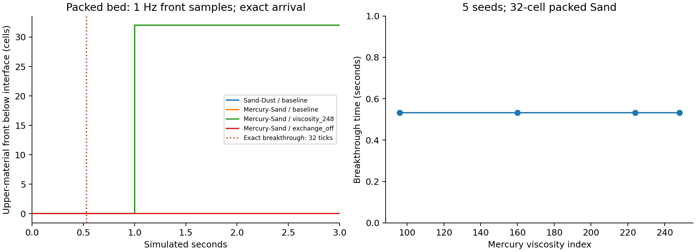
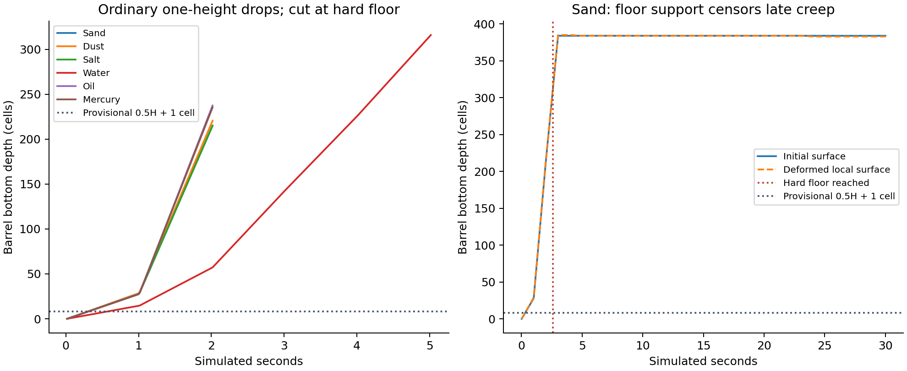
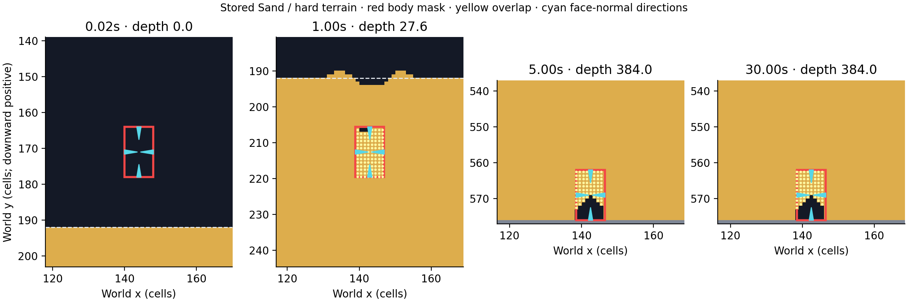
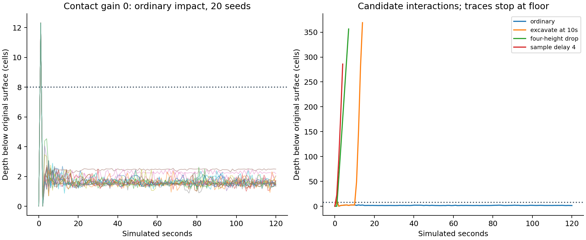

# Measured physics baseline, 2026-09-09

## Findings and decision boundary

[Issue #9](https://github.com/techrote/cybersand/issues/9) is a measurement
checkpoint. All four reported symptoms reproduce in the scoped fixtures, with
qualifications: density-exchanging powders interpenetrate, the player ignores
powders other than Sand, Mercury crosses packed Sand rapidly, and an ordinary
barrel reaches the deep floor through a granular bed. Hard Wall/Concrete controls
do not exhibit the same cellular exchange, and the isolated Rapier floor stops
the barrel. Chemistry, sampled collision and cellular coupling have different
causes and must not be fixed through one global solidity switch.

**Supported:** powder mixing is predominantly ordered density exchange in the
packed nonreactive controls. Mercury's viscosity gate does not slow that vertical
exchange. **Additional source-backed finding:** retained grains inside a barrel
can generate downward contacts using the Wall occupancy proxy as their source.
Removing the entire transient contact term arrests continued Sand descent in
screening, but its initial peak still exceeds the provisional half-depth envelope.
This diagnostic is not a production fix or proof of a persistent bearing model.

The production descriptor values, scene physics, ordinary reset defaults, body
message ABI and ownership remain unchanged. #10/#11 should choose and validate
new interaction/support rules using these fixtures. Issue #9 remains open; this
local checkpoint does not silently waive the release-provenance and coverage
limits below or change GitHub acceptance boxes.

## Reproduction, source and artifacts

Work started from clean `main` at
`ab4851e9e6a3ee182aba1a31a8f66d135e87df3a`, tag
`correctness-2026-09-08`, in `C:/kybersand/source`. The implementation is the local
`codex/issue-9-physics-characterisation` delta, recoverable from its commit and
the retained tracked-source patch/new-file snapshots. No unrelated source work
was present initially. Raw logs, including failed attempts, are retained under
`C:/kybersand/validation/local/2026-09-09-physics/`.

The [reproduction runbook](../operations/physics-characterisation.md) defines
geometry, seeds, schedules, metric meanings, units, bounds and commands. Each
series has `cases.json`, a source/dirty-file/artifact manifest, actual completion
records and build/execution logs. Final Godot control/creep batches additionally
capture their source before each process launch. The expanded Godot series has
one immutable group manifest. Its runner and simulation inputs were unchanged
through all five batches. Reduced tables retain result SHA-256 identities.

| Input | Actual measured identity |
|---|---|
| Host | Windows 11, `10.0.26200`, AMD64; PowerShell; Europe/London display time, manifests in UTC |
| Godot | `4.7.stable.official.5b4e0cb0f`, console executable in `C:/Godot47` |
| Native compiler / build | LLVM MinGW Clang 23.1.0, release CLI `-O3 -DNDEBUG -pthread -static`; adapter via SCons 4.10.1 and the pinned workspace wrapper |
| Python / plotting | Python 3.12.14; Matplotlib 3.10.6; exact dependency freeze in runtime manifest |
| Bindings / Web compiler | godot-cpp `101ae38034304346a46ea9ea84ae156d3e860496`, separate native/Web trees; Emscripten 4.0.20 |
| Rapier | v0.35.2; Windows DLL SHA-256 `4e26ffa78ec2aaff434c4a70cd2ec85288b10ba5237912c35f204cb1e6ed2180` |
| Rebuilt Windows CyberSand DLL | SHA-256 `45f4ba78787a9e2d4daefb9b3ba24b1e476cb496343f63e77dd75a3e1c712eb7` |
| Web compatibility native module | SHA-256 `ece6ae11e8049821ef077e5ca324c4a191485f55a4f3d7deee79bd8b7607c8bd` |
| Web threaded native module | SHA-256 `c8e4be910b089ba8bfa4556108bdf3680f5787accb1e23f2b4ffdee9ef99650f` |
| Browser | Actual Codex in-app Chromium, user agent `Chrome/152.0.0.0`, Windows; both pages cross-origin isolated |

Full CLI/DLL/Godot/export/PCK/Rapier hashes and source input maps are in
[series provenance](physics-2026-09-09/source-and-artifacts.json) and
[runtime provenance](physics-2026-09-09/runtime-manifest.json). Web `build-info`
still contains the wrapper's old acquisition label `e2892c54...`; it is not the
actual tested source revision. This report binds fresh module builds and subsequent
script exports using the actual HEAD/local file hashes. Published LFS runtime
manifests and historical M11 hashes are not rewritten to accept these local builds.

The final asynchronous rerun has its own [source manifest](physics-2026-09-09/async-manifest.json)
after adding explicit trace/CLI bounds. The later optional global Water accounting
branch has a separate series manifest. Original fixture source versions remain
recoverable in the raw source snapshots; optional accounting is off in the
earlier series and exact state/trajectory comparison checks its neutrality.

Commands run from the source directory, using the pinned workspace Python:

```text
C:/kybersand/dev.cmd native-build
C:/kybersand/dev.cmd native-test
C:/kybersand/dev.cmd godot-test
python tools/physics/run.py native --group expanded --seeds 5 --ticks 1800 --output <raw>/native-expanded
python tools/physics/run.py native --group controls --seeds 5 --ticks 1800 --output <raw>/native-controls
python tools/physics/run.py native --group finalists --seeds 20 --ticks 7200 --output <raw>/native-finalists
python tools/physics/run.py godot --group expanded --seeds 5 --ticks 1800 --output <raw>/godot-expanded
python tools/physics/run.py godot --group controls --seeds 5 --ticks 1800 --output <raw>/godot-controls-final
python tools/physics/run.py godot --group finalists --seeds 20 --ticks 7200 --output <raw>/godot-creep
C:/kybersand/dev.cmd web
C:/kybersand/dev.cmd web --profile threaded
C:/kybersand/dev.cmd web-export
C:/kybersand/dev.cmd web-export --profile threaded
python tools/physics/analyse.py <raw> docs/audits/physics-2026-09-09
python tools/physics/platforms.py <raw> docs/audits/physics-2026-09-09
python tools/physics/verify.py <raw> --output <raw>/evidence-check.json
```

`<raw>` is the dated raw directory above. Individual CLI executions have exact
argv and a 180-second timeout; CLI compilation uses 300 seconds. Godot batches
have a 3,600-second timeout. The asynchronous runner uses a 90-second deadline
per 1,800-tick seed. Browser execution was observed through DOM results and the
bounded loopback collector, not inferred from HTTP readiness or a headless owner.
The runtime manifest and browser record retain the actual URLs and collector
configuration. Neither tools nor raw logs were installed in `C:/cybersand`.

## Fixture coverage and budgets

Every variant starts with a fresh world, isolated Rapier space and fixed scene
parameters. Seeds 0–4 screen; 0–19 are finalists. A seed selects explicit
coordinate offsets and hole patterns over the engine's existing coordinate/tick
streams; it does not replace them with a new PRNG or replay all engine state.
At 60 simulated ticks/s, 1,800 ticks is 30 seconds and 7,200 ticks is 120 seconds.
Offline runs do not promise real-time pacing.

| Series | Coverage | Completed budget |
|---|---|---|
| Native expanded | All nine powder pairs in both distinct orders; packed/void/slope/unsupported/Stone granular modes; six liquids and reverse layers, 16/32/64 depths, open/saturated and reactive controls; hard Wall/Concrete | 810 × 1,800 ticks |
| Native controls | Exchange veto, viscosity, one-cell confinement, phased 1/4, observer off, serial, re-entry and excavation | 270 × 1,800 ticks |
| Native finalists | Selected exchange/viscosity/boundary/excavation and execution controls, 20 seeds | 440 × 7,200 ticks |
| Godot controls | P3/P4 baseline plus separate displacement/boundary/contact/cap/clamp/mass/damping/friction/sample-age families and execution controls | 225 × 1,800 ticks; six fallback cases × 180 ticks |
| Godot expanded | Player walk/slope/side/film/enclosed/falling states, interior sample control; barrel drops 0/1/4/8 heights, angles, size, mixed/liquid/hard controls, excavation/re-entry and 30/34-pixel nominal fast steps | 465 × 1,800 ticks |
| Godot creep | Baseline Sand/Dust/Mercury, cap 6, boundary 0.38, delay 4, excavation; contact-off alone and with excavation/drop 4/delay 4 | 220 × 7,200 ticks |
| Desktop asynchronous | Production worker loop, main-thread Rapier, separately recorded cellular and Rapier ticks | Five × 1,800 cellular ticks |
| Real Web | Compatibility 1 worker and threaded 4 workers; five seeds each of P1, Mercury/Sand, player/Dust, barrel/Sand and hard floor | 25 × 1,800 per profile |
| Global Water accounting | Repeated native barrel/Water with four bounded whole-world quadrants; compared exactly with original traces | Five × 1,800 ticks |

The completed evidence comprises **2,496 runs and 8,047,080 cellular ticks**,
excluding unit tests, development retries and earlier smoke series. The
[integrity result](physics-2026-09-09/evidence-check.json) passes 9,239 checks.
Reduced totals count 1,520 native CLI and 921 manual Godot runs; the 50 browser
and five asynchronous runs are retained in [platform data](physics-2026-09-09/platform-results.json).

The interpreted fallback uses six 3-second, single-seed diagnostic checks rather
than a full sweep: it is a distinct reduced implementation with expensive dense
script scans and no ordered native counters or conserved-Water probe. These runs
identify predicate/coupling differences, not native parity or 30-second fallback
support acceptance. Serial traversal is also distinct: matching-worker parity
applies to phased traversal, never automatically to `SerialInPlace`.

All ordinary barrel beds are 384 cells deep (over 27 barrel heights); the target
ordinary embedding is around seven cells. The hard floor is therefore far below
the intended support zone. Baseline barrels nevertheless reach it rapidly. Floor
contact explicitly censors subsequent creep measurements. Selected contact-off
runs permit an uncensored long-duration support investigation.

## P1/P2: exchange, void movement and chemistry

In the 32-wide, 32-deep packed fixture, Sand over Dust and Rust over Sand each
produce 16,384 swaps (512 upper cells traversing 32 lower cells), with the leading
material reaching the bottom in 32 ticks, **0.5333 seconds**. Reversing these
orders removes density exchange. Stone/Sand also breaks through in 32 ticks,
but brace-aware versus explicit granular state changes its detailed event totals
(15,936 swaps in the seed-0 brace-aware baseline). Empty moves and density swaps
are separate event classes; holes/open space introduce legitimate void motion.

Mercury over Sand crosses a 32-cell packed bed in 32 ticks for all five screening
seeds. Viscosity 96/160/224/248 leaves the recorded state hashes unchanged, both
in the ordinary confined box and a one-cell column. The target-wide powder
exchange veto removes swaps and breakthrough. **Rejected hypothesis:** increasing
viscosity alone controls this downward penetration. No 10–50× slowdown is achieved
or implemented here; that proposed target needs an independent exchange policy.

Water over Sand does not density-swap downward; Sand over Water does. Water,
Brine and Paste penetrate Dust in the eligible order. Oil does not, despite its
density exceeding Dust: its specialized movement path disallows that swap.
Lava/Dust and Water/Salt reactions change material identities and require the
conversion counters. They must not be described as missing or teleported mass
using nonreactive count equality. Excavating a native fixture's floor can also
let material leave its finite measurement ROI; those count changes are not proof
of destruction. Closed nonreactive controls and stored Water mass have separate
integrity checks.



The front curve uses one-second snapshots; the vertical marker and right panel
use exact per-tick breakthrough detection. Overlapping curves are identical
results, not missing series. Full data: [cellular results](physics-2026-09-09/cellular-results.csv),
[ordered events](physics-2026-09-09/ordered-events.csv),
[material counts](physics-2026-09-09/material-counts.csv). Per-material vertical
moments are retained for native centre-of-mass calculations; counts are not a
mass calibration between different material species.

## P3: player collision sampling

All five ordinary Sand cases remain at zero depth below the initial surface.
The other eight powders allow descent to the deep floor at tick 305. This
reproduces the hard-surface-or-Sand collision predicate; density does not imply
player support. The fallback Sand/Dust checks reproduce that distinction within
their shorter window.

Sand's predicate is not full-volume penetration recovery. Enclosed Sand spawns
remain grounded at 26 cells of initial penetration. A Sand cell initially inside
the player does not prevent descent. A one-cell unsupported Sand film falls;
it is not a stationary collider. In the excavation case the player loses the
original surface and later rests on deformed material roughly 189–203 cells
lower. Walking/side/slope cases retain input schedules and relevant foot/overlap
materials. A depth measured from the global flat datum on a slope is not itself
penetration into that local slope; the local-surface and contact fields disambiguate
it. Future material support policy and recovery from enclosure are separate rules.

## P4: barrel depth, impulses and long creep

An 8×14 barrel dropped one body height into Sand reaches the floor in
154–158 ticks across five seeds (2.57–2.63 seconds). Seed 0 reaches it at tick
155. Dust, Salt, Oil and Mercury also fail to support it. Sand and Salt have
identical baseline trajectories under the density clamp. Water delays floor
arrival to ticks 311–381 but supplies no tested floating equilibrium. Empty
freefall reaches it at tick 201, later than baseline Sand: the cellular feedback
can accelerate descent. The ordinary hard-floor control's peak penetration is
about 0.000458 cells, including the tested fast controls. Some granular-driven
cases transiently overshoot the deep floor by several cells; those stressed
coupled contacts are distinct from the isolated hard-floor control.



The left panel ends at the last sampled point before floor arrival; it does not
show the final unrecorded fraction of that approach. The right panel deliberately
shows the misleading long flat tail and labels its hard-floor cause.

At Sand seed 0's first floor observation, cumulative raw vertical terms are
displacement **−596.65**, boundary **−57.15**, pixel contact **+1,204.32**, and
accepted central impulse **+215.16**. Down is positive; these are adapter impulse
quantities, not SI force. There are 2,116 intermediate cap hits, 15,078 unresolved
overlap observations and 128 displaced cells by that point. Unresolved totals
count repeated observations of cells, not unique grains. Opposing per-add
saturation and the final cap mean the accepted impulse cannot be reconstructed
by merely summing the three raw totals and clamping once.

The source dispatches the stored powder kernel while `World::get` sees Wall under
the body mask. Retained grains therefore make downward contact attempts using
that proxy density. A minimal native regression records one retained Sand cell,
three downward attempts and a total raw vertical contact weight of 4,800 while
the stored Sand remains. This mechanism is additional to the absence of static
bearing. Disabling all pixel contacts changes more than this one path, so the
experiment does not establish that correcting only masked-source contacts is a
complete support fix.

**Separate hard-surface bypass:** the barrel/Water crop initially appears to lose
16,065–426,760 Water mass units across the five seeds. A full-world repeat retains
exactly **9,400,320 units** in every case; the entire deficit is below the one-cell
hard floor, with none above the crop. All original hashes and sampled trajectories
match the wider observer. `find_ejection_target` checks the destination's emptiness
without checking intervening terrain. A minimal Godot characterization moves one
Water cell across that floor during preparation alone, before any cellular tick
or Rapier step. Thus this is body displacement through a barrier, distinct from
Water mass loss, cellular density exchange and Rapier body tunnelling. The five
explicit [accounting fixtures](../../tools/physics/water-accounting.json) reproduce
it; run them with the ordinary Godot fixture script and record a fresh manifest.



These are reconstructions from retained authoritative cell frames: red rectangle,
yellow overlapped stored cells, gray hard terrain and cyan inward world-axis face
directions. Arrows are geometric directions, not measured contact locations or
force magnitudes. The body can overlap many stored grains even where presentation
masks them. The overlays were visually inspected, but are not live gameplay
video/screenshot acceptance.

### Controlled parameter results

Full median/min/max results and every setting are in the
[parameter table](physics-2026-09-09/parameter-results.csv) and
[per-run coupled data](physics-2026-09-09/coupled-results.csv).

| Family, other defaults held fixed | Screening result, five seeds | Decision |
|---|---|---|
| Powder-target exchange veto | No eligible swaps/breakthrough in packed controls | Confirms exchange causality; too broad for production pair policy |
| Mercury viscosity 96/160/224/248 | Identical vertical states/arrival | Reject as vertical slowdown control |
| Displacement 0/0.09/0.18/0.36 | All ordinary Sand barrels reach floor | Changes resistance; insufficient bearing |
| Boundary 0/0.095/0.19/0.38 | All reach floor | Inspect face balance before increasing pressure |
| Contact 0/0.0125/0.025/0.05 | Only zero avoids floor in all screening seeds; zero's peak 12.55–12.56 cells, final 1.24–1.82 | Isolate masked-source/attempt semantics next; peak still exceeds 8-cell provisional gate |
| Cap 1.5/3/6 | All reach floor; cap 1.5 arrival 169–178, cap 6 arrival 140–154 | Saturation matters, but increasing cap can increase harmful downward feedback |
| Density upper scale 1.6/3.2 | Sand baseline unchanged | Sand is already 1.6; this is not a Mercury clamp sweep. Native transient contacts retain their separate 1,600 density clamp |
| Mass 0.5/1/2 | Load-sensitive and seed-sensitive; 0.5 has one non-floor case but does not meet the impact/creep gate | No reliable support envelope; keep gravity fixed |
| Damping 0.5×/1×/2× | All reach floor | Slows motion, supplies no static force at rest |
| Friction 0.4/0.78/1 | Baseline Sand trajectories unchanged | Central cellular feedback has no frictional bearing contact |
| Delay 1/2/4/8/9 | Increasing delay changes arrival; age 9 rejects results and matches freefall | Latency affects feedback; raising rejection limits is not a support fix |
| Duplicate, observer off, phased 1/4 | Exact recorded states and trajectories | Measurement and matching-worker controls |
| Serial, fallback | Distinct data and semantics | Do not claim traversal or backend parity |

### Long-duration finalist outcome

All 220 finalist runs completed 7,200 ticks. With contact disabled, all 20 ordinary
Sand drops avoid the floor: peak depth median **12.556**, maximum **12.572** cells;
final depth median **1.537**, range **1.328–2.494**; last-ten-second depth change
median **+0.067**, range **−0.262 to +0.508** cells. Motion continues near the
surface, so this is dynamically sustained support rather than a sleeping bearing
state. Every peak exceeds the provisional eight-cell ordinary-impact envelope.

Excavation at tick 600 makes all 20 contact-off barrels fall to the floor, at ticks
820–997. All 20 four-height drops also reach the floor. All 20 ordinary drops
with contact off **and sample delay four** reach the floor as well: sample-age
attenuation can destroy the experimental support even though zero-latency baseline
already fails for another reason. Cap/boundary increases in the ordinary baseline
do not establish support. No candidate is promoted to a production default.



## Platform and measurement validation

| Check | Actual outcome and scope |
|---|---|
| Native unit suite | 49 tests pass, including exact state/histogram observer and phased worker comparisons, overflow, viscosity and masked-source tests; C11 header check retained |
| Godot suite | 19 runners pass against freshly rebuilt Windows extension, including F01/F02, save/conservation/render ownership, manual Rapier and new diagnostic smoke checks |
| Full evidence integrity | Completion, conservation controls, observer/worker comparisons, hard-floor tolerances and zero overflow checked by the linked evidence-check record |
| Desktop asynchronous | Five final seeds complete 1,800 cellular ticks each; 1,802–1,804 actual Rapier steps, zero worker overruns, mostly age 0/1 with isolated ages up to 5; all reach floor at cellular ticks 151–167. Host ran other development experiments concurrently; no exact async trajectory parity claim |
| Real Web compatibility/threaded | 25 fixtures each complete; all corresponding cell hashes and sampled trajectories match exactly, with zero overflow. Threads are synchronous at the external tick boundary; this does not certify asynchronous Web ownership |
| Real browser F01/F02/Rapier | Both profiles pass fault recovery/quarantine and region pause/re-entry. Rapier: 600 ticks, 308,087 contacts, 151 displaced, same reported body states; threaded owner uses 6 workers for this existing probe |
| Real browser worker parity | Existing one/four-worker phased probe: 120 matching hashes, 98,286 moves, 480 parallel phases. UI field named `serial` means one-worker phased here, not `SerialInPlace` |
| Linux, sanitizers, other browsers/devices | Not executed for this delta: WSL is not installed, and no Linux/macOS/mobile runtime was available. Earlier Linux/sanitizer results are historical, not carried forward |

The native series observed at most six scheduled cores, 20 resident chunks and
zero tick-time chunk allocations in these prepared fixtures. Maximum used native
histogram entries were 167 of 8,192 merged slots, with zero recorded overflow.
The suite deliberately exercises overflow in a two-slot histogram and verifies
that it is an explicit diagnostic outcome. Adapter/core capacities, raw timings
and used histogram fields remain available per result. Job-local tables have a
different 256-slot bound; a low global count is not a universal capacity proof.

Tick timings include the native tick call; coupling timings cover Rapier step,
sampling and pre-tick overlap/pressure preparation. Application and snapshot
analysis are excluded. Median/p95/max are retained per run, including outliers;
concurrent workloads and settled/inactive worlds make cross-series performance
ratios unsuitable as production benchmarks. Construction uses fixed hard
colliders, so there is no changing terrain extraction backlog in these offline
cases; the existing Web regression reports pending terrain work zero. Backlog
under edits, per-block quiet/wake timing and allocation-pressure scaling need
separate dynamic measurements.

## Failed attempts, open limits and successor tests

Failures are retained, not silently replaced: an early native observer fixture
exhausted its configured core capacity and was corrected to a sufficient explicit
budget; an early Water probe used occupancy-masked mass and was corrected to
stored mass; asynchronous setup initially sampled a body before scene insertion
settled and was corrected; first release-Web fixtures put construction inside
`assert`, which release export removed. The empty-world Web results are invalid.
Construction now executes outside assertions and checks nonempty walls, completed
ticks and the hard-floor control. Both exports were regenerated and actually
rerun. `godot-controls`, `-v2`, `-v3` and earlier smoke logs are retained as
development history; the final report uses `godot-controls-final` with explicit
batch manifests. The original v3 runner was reconstructed and verified against
its recorded SHA-256 for recoverability.

The following gaps are specific, not implied acceptance: no player/moving-barrel
shared fixture, multiple-barrel load path, general shape/torque calibration,
two/four coupling substeps, flood/explosion loss-of-support series, or dynamic
collider backlog saturation. Interior/enclosed and sampled contacts cannot
establish arbitrary penetration recovery. Long-term floor-censored runs do not
establish a granular creep rate. The fixed seeds move across cell/core/chunk
boundaries and exercise selected re-entry; they are not exhaustive scheduler
boundary or timing coverage. Candidate numerical tolerances and the proposed
10–50× Mercury slowdown remain provisional.

Recommended next implementation experiments:

1. **#10 — explicit interaction policy.** Independently gate ordered powder/powder
   and liquid/powder exchange; test both initiating directions and every downward
   alternative so multiple attempts do not multiply an intended rate. Start with
   the packed 32-cell Mercury/Sand baseline and 10/30/60-tick eligibility proposals,
   then test void fall, open spreading, Stone bracing, chemistry, Water conservation
   and eventual progress after sleep/re-entry. Do not reduce density or change
   lateral viscosity to fake permeability.
2. **#10 — sampled player support.** Separate material support capability, packing
   and side resistance. Preserve loose falling grains and films. Add explicit
   enclosure recovery and a moving-barrel shared fixture before treating the
   sampled predicate as a general collision solver.
3. **#11 — correct feedback before tuning bearing.** Compare original behavior,
   masked-source contact suppression only, one contact per intended opportunity,
   and independent cap accumulation. Preserve contact from real incoming grains.
   Measure raw directions and accepted impulse before adding static support or
   contact-point torque. Add a bounded ejection-path barrier test while conserving
   unresolved cells when no valid exit exists; the Water fixture proves why empty
   destination checks are insufficient. The all-contact-off result is a diagnostic upper bound
   on this intervention, not the selected implementation.
4. **#11 — choose a bounded support model.** Once feedback is controlled, compare
   packing/yield response with a revisioned stationary proxy, designating one
   solver per contact mode. Use mass 1, gravity scale 0.094, one/four-height drops,
   the initial and local surface datums, deep-floor censoring and last-ten-second
   creep. Screen five seeds/30 seconds, then 20/120 seconds. Require excavation
   to remove support and test tilted/multiple/fast bodies plus measured latency.
   The owner wants roughly half-depth embedding; the provisional `0.5H+1` and
   one-cell creep gates are not final gameplay tolerances.

## Documentation and repository checks

The canonical runbook owns instrumentation/fixture definitions. Materials,
coupling, ownership, interfaces, configuration/capacity, invariants, ADR-007/009,
profiling/build/tests, source recovery, handover, roadmap and evidence routes are
synchronized. Navigation/corpus route the dated report explicitly. C07–C10 add
measured-physics retrieval challenges; the frozen 32 questions and prior plan
history are preserved. Save schema, controls, authored material programs and
native/Godot ownership do not change, so no new gameplay UI or persistence
contract is introduced.

Repository and retrieval checker outcomes are retained in the linked validation
record. The published-runtime identity gate remains distinct: local diagnostic
source and rebuilt DLL differ from the retained published Windows/Linux inputs.
Linux cannot be rebuilt/executed here. A fresh source build is required to use
the new API from another checkout; no stale manifest is relabeled as validated.
Historical M11 integrity remains an independent check.

The [validation record](physics-2026-09-09/validation.json) records: documentation
check passed (51 focused documents, no errors/warnings); retained M11 integrity
passed; all eight checker-contract tests passed; frozen retrieval 32/32 top-five
and 23/32 top-one; final supplementary retrieval 10/10 top-five and 9/10 top-one; `git diff --check`
passed. C07/C08 initially ranked the historical plan ahead of the measurement
runbook; focused current-answer sections and rerun results are disclosed in the
raw retrieval logs. Manual review confirms source/evidence/future-policy qualifiers;
C05/C06 still require following the measured-report link when asking for runtime
results. C09's current coupling answer is second, behind the historical planning
chunk. Lexical hits are not semantic acceptance or held-out improvement claims.

`check_repository.py` **fails with ten published-runtime identity errors**: four
changed source inputs per platform, changed local Windows bytes and its changed
LFS working-file identity. This is a current publication gap, not a failed physics
test or corrupted M11 record. The rebuilt local DLL remains a development output;
it is excluded from the source commit. Linux/published-runtime reconciliation and
the specifically listed interaction/visual gaps remain outstanding.
