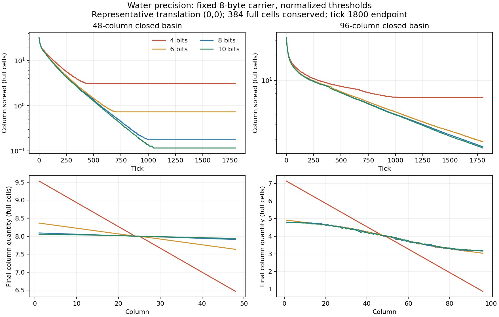

---

title: Issue17 fixed-carrier Water precision evidence and G-P review

status: Current

document-kind: evidence

scope: Completed Windows native P1 mass, P2 threshold and P3 coherent-delay research; no production migration

canonical-for: []

last-reviewed: 2026-09-11

related-documents: [../operations/state-precision-experiment.md, ../operations/architecture-programme.md, 2026-09-11-issue-17-worker-supplement.md]

---

# Issue17 Water precision evidence

## Result and staged recommendation

**G-P: COMPLETE / evidence reviewed. Retain mass8 as the reference for subsequent

controlled work. Water coherent delay4 exactly represents the existing0..12

semantics.** This gives a Water-specific12-bit mass/delay semantic budget, not a

selected Cell layout, generic state compression, production precision migration

or history implementation. Other materials retain full-byte state semantics.

Mass4/6 preserve the tested supported film but lose meaningful leveling and ledge

discharge; their apparent savings largely come from stopping with coarser residuals.

Both also quantize requested1/255 and2/255 droplets to zero before simulation.

Mass10 has measurable modest benefits, not merely unused states: better narrow

levelness, slightly more discharge, finer low quantities. It adds narrow/ledge

active work and does not remove the wide basin's finite-time residual. These

results do not justify replacing mass8 as the downstream control.

The G-P result selects, at most, an experimental state budget for downstream

controlled work. It does not select a production Cell layout or authorize

production Water migration. **This is a controlled experimental budget for

evaluating motion/history semantics, not a production Water precision migration.**

Issue18's P prerequisite is satisfied; its concrete measured directional-persistence

target remains unproven and implementation requires its own admission. Issue19 is

independent, Issue20 remains blocked by M/G-M and its own gate, G-final stays open.

## Identities and reproducibility

Starting source f3fb9de2c6e62907b07b50c7036af389da67d4a5 is the current published

programme reconciliation, newer than remote main ab4851e. Branch/worktree:

codex/issue-17-state-precision in C:/kybersand/worktrees/issue-17-state-precision.

Registration6ae3dd5 precedes candidate code; implementation8fff609 passes both

native controls; af17fcc registers additional same-phase validation and freezes

the independent reducer before timing. Preparation manifests identify6ae3dd5

plus exact local input hashes, whose core/harness bytes match the later checkpoints.

Remote and local C cdb4c2a, L4726f8d and programme f3fb9de were verified. Connector

identity techrote was used because local gh is unauthenticated.

Reuse L2's validated uint64 16/40/8 mask/shift carrier from b97c7c1, admitted by

completed L. Every P executable has size/stride/alignment8/8/8, material bits0..15

with legacy IDs, a16 at16..31, b8 at32..39, unused40..55 and epoch8 at56..63.

Spare state capacity accommodates every mass arm without moving fields between

arms. Delay4 masks only Water b; no sidecar or epoch change. This is a native-only

experimental ABI: compact C queries, rendering and saves are not a mass10

migration path. The unmodified-source control validates the relocated accessor

mapping at mass8; no4-versus8-byte timing comparison is part of P.

Windows x86_64, AMD Ryzen5 2600X (6 cores/12 threads),32GB installed RAM, Balanced

power scheme; Python3.12.14; LLVM-MinGW Clang23.1.0/UCRT, compiler commit

ea7d852a70e8bdfaf601d6626a760f9771b2c4b4. All optimized arms use C++20,

O3/NDEBUG/LTO, pthread/static and identical warning flags. Focused/full tests use

O0/g3; supplementary concurrency uses the same optimized core. No DLL or bindings

build, source baseline edit or production merge occurred. Original dirty DLL

remains fc6cb4ee1096219f581bace3df04ee8138e996aaf4c1436f5b2c071ea62dd496.

Raw evidence root is worktree validation/local/issue-17/:

prepare-20260911-104311, behavior-20260911-105002,

workers-20260911-110341 and timing-20260911-110539. Commands, timeouts, outputs,

source/compiler/executable identities and run order are retained. The

[integrity manifest](issue-17-2026-09-11/integrity.json) verifies1803 output hashes,

including build/test outputs,1328 behavior processes,392 timing processes and36

extended verification processes. No failed runtime attempt, timeout, outlier

deletion or candidate rescue occurred. The direct documentation topology failure

and inherited release failures are retained separately below.

Reproduction uses tools/experiments/state_precision.py prepare, then behavior

and measure with the emitted --manifest, with precision_workers.py between the

two campaigns. summarize_state_precision.py independently validates/reduces

completed.json files. Native core inputs and mathematical registration are frozen

by the runner before measurements. Raw JSONL/executables stay outside committed

source; [behavior reductions](issue-17-2026-09-11/behavior.json),

[all timing samples/pairs](issue-17-2026-09-11/timing.json) and

[selected frozen states](issue-17-2026-09-11/frozen.json) are curated derivatives.

## Correctness and scope of equivalence

- All1328 behavior processes preserve exact initial integer quantity every tick;

  all closed fixtures have zero registered source/sink. Runtime drift is zero.

  Full-cell basins and ledges have exactly equal requested physical inputs.

- Mass8 control matches unmodified current source through all eight fixtures,

  both workers, and observer off/on. Each of eight configurations runs eight

  fixtures, five signed/mirrored translations, workers1/4 twice:1280 candidate

  processes. Every matching within-arm semantic/work/event trajectory agrees.

- Every delay4 versus delay8 trajectory agrees at mass8 across all40

  fixture/translation groups and both workers/repeats. Focused tests exercise all

 169 max-merge pairs, legal countdown values, pre-decrement suppression, lateral

  release, repeated transfer, Empty reset, movement and temperature transfer.

  Every non-Water byte a/b combination is preserved by the shared accessor test.

- Both unmodified source and fixed-carrier mass8 pass all55 native tests; C11

  header check passes. Each of eight arms passes focused storage/Water tests.

  [Supplemental tests](2026-09-11-issue-17-worker-supplement.md) pass four

  simultaneous same-phase jobs,1/4 workers twice,1800 ticks in every arm.

- The36 extended1920-tick runs check exact accounting every tick. Their first1800

  ticks match primary observed trajectories, including observer-off variants.

  All392 timed final states and work match those verification controls. No

  allocation or diagnostic overflow occurs. These are canonical field-based

  fingerprints/snapshots, not cross-ABI raw state-hash equivalence.

## Quantization, precision and threshold policy

The unchanged [registration](../operations/state-precision-experiment.md) defines

Q=floor((2*n*M+d)/(2*d)), nearest/half-up, physical fill=m/M. Pair addition and

subtraction remain exact; requests floor(3*imbalance/4) and capacity caps remain

unchanged. Ledger quantities are integers in each arm's own lattice. Normalized

starting error is reported separately; it is never called runtime drift.

P1 uses normalized film48/255 and rest1/255. Their integer mappings are

film3/12/48/193 and tolerance0/0/1/4. P2 changes only tolerance to literal1;

film remains physically normalized so the comparison does not redefine film.

Mass8's two policies are identical and reuse its measured control; there is no

invented independent literal8 sample. Delay remains8 throughout P1/P2.

The exact low-difference explanation: at coarse precision an integer difference1

passes normalized tolerance0, but floor(3/4)=0. Literal tolerance1 stops before

request calculation. Every mass4/mass6 content/work trajectory is therefore

identical between the two policies in all40 cases, despite different zero-request

counters. That negative P2 result prevents attributing their poor slopes to this

tolerance-policy choice. The tiny physical1/255 and2/255 inputs vanished at initial

quantization in both coarse arms; the independent lattice(2,1)/(1,0) lanes still

contain positive quantities and expose the arithmetic stall directly.

Mass10's literal1 has a different physical meaning from normalized4. In the

48-wide basin it reduces median terminal spread0.11437 to0.04497 cells and

increases visits433025 to522248. Ledge visits rise55651 to71683, with smaller

spread. Wide basin residual changes only1.61877 to1.60997 cells at1800. Film is

unchanged. These are P2 policy effects, not improvements silently credited to P1.

## Behavioral interpretation

All four films remain exactly their quantized initial quantity for1800 ticks,

with one residue, zero transfers and three visits; no evaporation or collapse.

Their normalized starting errors are +0.0117647/+0.0022409/0/+0.0004255 full cells.

Film preservation alone is insufficient: mass4/6 lose useful low-quantity and

discharge behavior. Numerical coarse slopes are demonstrated; no fresh gameplay

visual acceptance or subjective pixel-quality claim is made.

The48-wide basin's terminal integer spread is46 at mass4/6/8, hence very different

physical slopes. Mass4 also rests in the96-wide basin with6.27 cells spread;

mass6/8/10 are still changing at1800. Mass10 improves narrow spread and reaches

the one-cell criterion slightly earlier, but extends final activity. Its wide

residual is close to mass8. **Precision affects final residuals, but increasing

8 to10 bits does not remove the wide finite-horizon residual.** Finite-time local

relaxation remains a plausible contributor; no claim of universal asymptotic

convergence or a newly contradicted G-C sleep result is justified. No sleep

diagnostic was needed or run.

Ledge discharge is measured as quantity below y23, out of64 initial full cells.

Mass4/6/8/10 discharge49.87/55.90/58.80/59.10 by1800, while ending with

95/115/119/119 occupied Water cells. Coarse arms stop much sooner with less

discharge and fragmentation. Basin96 front arrival medians297/256/250/251 show

mass4's slower front; ledge arrival37 is identical at the registered threshold.

Ordinary versus coherent releases retain their distinct native countdown paths.

The plot uses representative translation0; tables use medians of all five

translations, workers1 (workers4 exact). Raw trajectories and normalized column

profiles are retained, including signed storage/core seams. Last change is not

time to equilibrium: rest requires a40-tick unchanged tail;1800 is censored where

content still changes. Active lifetime counts last tick with visits, separately.

## Performance interpretation

Primary timing uses observer off, no per-tick semantic traversal,120 retained

warmup ticks then1800 steady ticks. Every comparison uses seven alternating

AB/BA independent pairs. Quantiles are nearest-rank within each process, then

medians across processes; ratios are calculated per pair before taking medians.

Startup is World construction/preparation, not a claim of measured OS loader time;

whole-process elapsed time and all raw tick times are also retained.

There is **zero Cell byte-bandwidth saving**. In basin comparisons, median paired

ns/visit ratios stay approximately0.974..1.010. Steady total time ratios versus

mass8 are mass4:0.385..0.387 narrow,0.521..0.526 wide; mass6:0.668..0.671 narrow,

1.004..1.009 wide; mass10:1.022..1.046 narrow,0.994..1.009 wide. These mostly track

different amounts of work, not cheaper quantity operations. Mass4's ledge p95

collapses because nearly all steady ticks are already asleep, despite poor

discharge; its ns/visit ratio actually rises1.302..1.715. Mass10 ledge steady

total rises1.113..1.119 for only about0.30 additional discharged full cells.

Delay4 has exact work and behavior, but coherent-ledge median total ratios

1.019/1.017 and p95 ratios1.020/1.006 at workers1/4. Thus it is an exact semantic

storage budget, **not a demonstrated computational speedup**. Observer-on cost

is separately measured: median total ratios1.034..1.055 on basin96; primary

timings never substitute observed costs. Four of196 individual pairs exceed the

registered p95+15% review screen; no comparison median does. All tails remain.

The host was not isolated: process snapshots show ordinary HWiNFO, Task Manager,

ChatGPT and Firefox CPU activity during the campaign. There were no overlapping

agent builds/benchmark campaigns. Controlled pairing helps, but these are

Windows-host estimates, not significance claims or production performance limits.

Per-visit cost includes scheduler/sleep/epoch overhead; it is not a microbenchmark

of a single arithmetic operation. Full-run work and steady-window work have

different horizons and are never interchanged.

## Evidence limitations and preserved boundaries

One Windows/native core host/compiler and these fixtures only. No fresh Linux,

Web/Wasm, Godot owner/adapter/browser, sanitizer, PMU/GPU or gameplay visual

acceptance. No general reactive mass or unlike-liquid contract is established;

optional mixing is disabled and production chemistry policy is not migrated.

The wide basin remains finite-time censored. Frozen Water states are supplementary

inputs only if Issue19 later wants them; they do not change its scope.

Quantity-operation reporting counts successful transfer transactions and the

two exact ledger updates per success, plus Water updates/requests/probes. It does

not claim complete CPU instruction/read/write counts. Wake/sleep counters are

block transitions, include construction/empty-block effects, and are not exact

per-cell wake causes. Timing is not instrumented with those counters; matching

observer runs supply work details. Existing temperature storage is preserved;

no new optional state allocation is introduced.

No permanent Cell width, production Water precision, epoch width, scheduler

geometry, material ID expansion, new sidecar, velocity/history, approximate

conservation, liquid unification, ballistic/soliding feature, Issue18/20

implementation or G-final closure is authorized or performed.

## Documentation and validation

Registration, this audit, programme/G-P, Water/storage/build/identity references,

roadmap, retrieval corpus/routes and current gate expectations are synchronized.

Production ADRs, ownership, external snapshots, profiles, controls, saves and

runtime provenance remain unchanged; the native experimental interface limit is

explicit. Historical C/L/M11 evidence is retained. Generated source-validation

snapshots use byte copies plus actual companion inputs, not rewritten links.

Final checker outcomes and publication readback are recorded after the tables.

## Measured tables

All following behavior medians use five registered translations; error and

quantity accounting precede normalization. Timing rows keep separate paired

controls. Full ranges, each sample, events and source identities are in the

linked JSON reductions; no selection based on a favorable median is made.

### Precision and accounting

|Mass bits|M|Initial basin integer total|Film integer / starting error in full cells|Low-fixture starting error|Runtime drift|

|---|---:|---:|---|---:|---:|

|4|15|5760|3 / +0.0117647|-0.0156863|0|

|6|63|24192|12 / +0.0022409|-0.0156863|0|

|8|255|97920|48 / +0.0000000|+0.0000000|0|

|10|1023|392832|193 / +0.0004255|-0.0000460|0|

All basins/ledges have zero starting error. The low fixture includes explicitly arm-dependent lattice lanes; its initial error compares each run with its own requested rational input, not another arm’s requested volume. Q is the same nearest/half-up rule for all arms.

### Precision behavior

|Bits|48-wide spread (cells)|48-wide last change / active|96-wide spread (cells)|96-wide last change / active|Wide front arrival|Film survived|Ledge discharge /64|Ledge occupied|Ledge last change / active|

|---|---:|---|---:|---|---:|---|---:|---:|---|

|4|3.06667|464 / 467|6.26667|1066 / 1069|297|5/5, >=1800 ticks|49.86667|95|134 / 137|

|6|0.73016|726 / 729|1.87302|1800 / 1800|256|5/5, >=1800 ticks|55.90476|115|282 / 285|

|8|0.18039|1021 / 1024|1.66275|1800 / 1800|250|5/5, >=1800 ticks|58.79608|119|518 / 521|

|10|0.11437|1089 / 1092|1.61877|1800 / 1800|251|5/5, >=1800 ticks|59.09775|119|574 / 577|

Mass4 never reaches one-cell column spread in either basin. The48-wide one-cell crossing occurs at medians591/563/550 for mass6/8/10. Wide mass6/8/10 have no40-tick stable tail at1800; their listed last-change/active values are censored. All films have one residue and no ongoing activity after tick3.

### Full1800-tick work

|Arm / fixture|Visits|Active-block ticks|Successful transfers|Exact +/- ledger operations|Lateral requests / probes|Zero requests|Block wakes / sleeps|

|---|---:|---:|---:|---:|---|---:|---|

|m4 / basin48|185,942|5,866|33,428|66,856|25,700 / 362,840|7,415|16 / 16|

|m4 / basin96|438,495|15,573|75,784|151,568|88,055 / 862,770|35,770|43 / 43|

|m4 / ledge|11,651|1,830|4,738|9,476|6,646 / 18,976|3,448|16 / 16|

|m6 / basin48|289,841|8,945|59,835|119,670|41,032 / 570,438|7,132|16 / 16|

|m6 / basin96|734,076|26,818|181,841|363,682|158,117 / 1,450,262|27,408|28 / 13|

|m6 / ledge|26,288|4,170|13,093|26,186|15,752 / 45,728|5,189|16 / 16|

|m8 / basin48|406,158|12,330|88,053|176,106|51,069 / 802,676|0|16 / 16|

|m8 / basin96|726,247|26,822|240,679|481,358|161,701 / 1,433,228|0|31 / 16|

|m8 / ledge|50,424|8,083|25,588|51,176|21,876 / 92,548|0|16 / 16|

|m10 / basin48|433,025|13,260|95,943|191,886|55,008 / 856,496|0|19 / 19|

|m10 / basin96|725,565|26,827|258,704|517,408|169,268 / 1,432,240|0|28 / 13|

|m10 / ledge|55,651|8,698|27,752|55,504|23,794 / 102,378|0|18 / 18|

Water-update counts equal visits in these pure-Water fixtures. The transferred-integer-unit totals, late changed-tick counts, occupied/tiny residues and min/max ranges are retained in behavior.json. Zero tiny-residue counts in mass4/6 use a normalized threshold that itself rounds to zero; they must not be interpreted as successful cleanup.

### P2 threshold isolation

N = normalized tolerance; L = literal1. Film remains normalized in both.

|Bits|N / L tolerance|Identical content/work trajectories out of40|48-wide spread N / L|96-wide spread N / L|Ledge visits N / L|

|---|---|---:|---|---|---|

|4|0 / 1|40|3.06667 / 3.06667|6.26667 / 6.26667|11,651 / 11,651|

|6|0 / 1|40|0.73016 / 0.73016|1.87302 / 1.87302|26,288 / 26,288|

|8|1 / 1|40|0.18039 / 0.18039|1.66275 / 1.66275|50,424 / 50,424|

|10|4 / 1|10|0.11437 / 0.04497|1.61877 / 1.60997|55,651 / 71,683|

### P3 Water-only delay equivalence

|Dimension|Delay8 versus delay4 at mass8|

|---|---|

|Legal values|All0..12 exact; native experiment rejects higher Water delay|

|Merge|All169 pairs preserve max; repeated transfer and Empty reset pass|

|Countdown|All0..12 pre-decrement suppression and expiry checks pass|

|Movement|Mass/delay and existing temperature transfer preserved|

|Behavior / work|Every matched40-case trajectory, workers/repeats, equal|

|Other materials|Full-byte a/b accessor combinations retained; no generic four-bit-state claim|

|Cost, workers1/4|Total1.019/1.017x; p951.020/1.006x; no byte saving or speedup established|

### Primary timing distributions

Each cell is **control / candidate** median over seven processes, preserving the paired controls. Tick quantiles and maximum are microseconds; total is steady milliseconds; ns/visit uses steady visits. Candidate labels m4/m6/m10 belong to P1; d4 belongs to P3.

|Candidate / fixture / workers|p50 us|p95 us|p99 us|max us|Total ms|ns/visit|Median paired total ratio|

|---|---|---|---|---|---|---|---:|

|m4 / basin48 / 1|150.30 / 0.50|176.70 / 171.90|180.90 / 174.90|292.40 / 294.10|157.37 / 60.18|438.63 / 437.10|0.385|

|m4 / basin48 / 4|171.90 / 0.50|244.20 / 224.20|302.80 / 263.10|466.30 / 427.40|205.42 / 78.45|572.55 / 569.79|0.387|

|m4 / basin96 / 1|178.70 / 174.10|185.60 / 181.40|209.00 / 191.00|318.90 / 312.40|324.01 / 169.76|445.68 / 436.83|0.521|

|m4 / basin96 / 4|224.00 / 215.20|256.30 / 258.00|322.00 / 309.70|438.50 / 465.20|412.46 / 217.93|567.34 / 560.77|0.526|

|m4 / ledge / 1|0.50 / 0.50|81.80 / 0.60|84.40 / 52.70|190.80 / 117.50|31.75 / 2.67|788.63 / 1352.99|0.084|

|m4 / ledge / 4|0.50 / 0.50|128.90 / 0.60|158.30 / 74.40|260.20 / 128.80|50.11 / 3.19|1244.56 / 1616.72|0.064|

|m6 / basin48 / 1|150.40 / 0.60|176.30 / 173.60|183.00 / 177.20|317.20 / 299.00|156.92 / 104.81|437.39 / 434.35|0.668|

|m6 / basin48 / 4|172.50 / 0.60|236.30 / 224.70|287.00 / 258.80|414.60 / 396.50|201.99 / 134.34|563.01 / 556.70|0.671|

|m6 / basin96 / 1|177.80 / 178.00|184.60 / 185.00|202.00 / 239.90|326.80 / 351.30|322.26 / 324.31|443.27 / 440.26|1.009|

|m6 / basin96 / 4|223.60 / 222.40|262.10 / 270.40|330.40 / 339.40|404.90 / 496.80|412.54 / 413.99|567.45 / 562.01|1.004|

|m6 / ledge / 1|0.50 / 0.50|82.10 / 77.20|84.80 / 81.30|190.30 / 165.20|31.88 / 13.23|791.83 / 832.82|0.412|

|m6 / ledge / 4|0.50 / 0.50|127.90 / 120.20|158.90 / 133.70|261.70 / 230.50|49.86 / 19.96|1238.25 / 1256.64|0.399|

|m10 / basin48 / 1|150.90 / 170.20|177.80 / 177.80|184.10 / 193.80|316.30 / 324.10|157.42 / 165.43|438.78 / 442.91|1.046|

|m10 / basin48 / 4|172.90 / 211.70|245.90 / 236.80|285.10 / 292.00|437.10 / 395.50|204.18 / 209.91|569.10 / 562.00|1.022|

|m10 / basin96 / 1|177.90 / 179.30|184.70 / 186.20|195.50 / 204.70|323.00 / 322.30|321.95 / 324.93|442.84 / 447.32|1.009|

|m10 / basin96 / 4|223.80 / 223.80|263.20 / 261.50|324.40 / 333.90|448.10 / 471.70|414.82 / 413.22|570.59 / 568.87|0.994|

|m10 / ledge / 1|0.50 / 0.50|81.80 / 81.40|84.50 / 83.80|187.50 / 205.20|31.87 / 35.40|791.39 / 797.76|1.113|

|m10 / ledge / 4|0.50 / 0.50|127.90 / 127.30|157.40 / 156.80|294.50 / 291.50|49.07 / 55.49|1218.57 / 1250.52|1.119|

|d4 / coherent / 1|0.50 / 0.60|81.30 / 83.30|84.70 / 87.20|188.90 / 200.70|29.68 / 30.58|772.38 / 795.88|1.019|

|d4 / coherent / 4|0.50 / 0.60|127.00 / 127.80|149.40 / 151.50|275.30 / 290.00|45.88 / 46.52|1194.14 / 1210.59|1.017|

All warmup/startup distributions, steady visits/block ticks, seven individual ratios and all392 process reductions remain in timing.json. Behavior tables summarize1800 ticks across five translations; timing uses shift0 over1920 ticks and excludes its first120 only from steady statistics. Thus their visit totals deliberately differ.

### Observer cost

|Mass / workers|Median paired p95 on/off|Median paired total on/off|Individual p95 review flags /7|

|---|---:|---:|---:|

|m4 / 1|1.048|1.055|0|

|m4 / 4|1.040|1.040|0|

|m6 / 1|1.041|1.046|1|

|m6 / 4|1.044|1.047|0|

|m8 / 1|1.050|1.039|0|

|m8 / 4|1.044|1.038|0|

|m10 / 1|1.037|1.040|0|

|m10 / 4|1.028|1.034|0|

## Final validation review

Validation folder: validation/local/issue-17/validation-20260911-111801. The
[curated checker results](issue-17-2026-09-11/validation.json) retain exact failures
and retrieval ranks.

- Documentation passes with the byte-copy source snapshot and actual companion inputs. Direct worktree invocation retains six missing companion-path failures; links/history were not rewritten to hide the topology.
- M11 passes28 historical source hashes and18 retained records. All8 checker regressions and4 precision Python tests pass; git diff --check passes.
- Experiment snapshot retains14 Windows/Linux published-source attestation failures; original baseline retains the same16 provenance/LFS failures. No runtime provenance hash is rewritten, and this is not a release acceptance.
- A documentation-only helper failed on Windows default cp1252 while reading UTF8. The failed generated audit bytes were retained and explicit UTF8 resumed the missing edits; no native source, executable, scientific rule or measurement changed. Compiler warnings for narrow presentation/C-ABI queries remain evidence that mass10 is not an integrated adapter migration.

|Retrieval set|Hit@1|Hit@5|MRR@5|
|---|---:|---:|---:|
|challenges|12/16|16/16|0.8594|
|frozen|22/32|32/32|0.8229|
|gates|2/3|3/3|0.7778|
|precision|3/3|3/3|1.0|
|programme|4/5|5/5|0.84|

All frozen query wording is preserved. Current PG prerequisite facts were explicitly
updated for completed P; this is not an unseen-evaluation claim. Manual review
confirms the new precision questions retrieve G-P and the mathematical contract;
existing gate questions still need top-five context and have first-hit limitations.
Canonical hits alone are not answer correctness. No historical audit was rewritten.

Source baseline remains f3fb9de with only the original dirty DLL, whose SHA-256
was rechecked unchanged. All experiment code/results remain on the separate branch.

## Publication and gate readback

Evidence checkpoint5fdca7c655a81d9693247d5e33a6db4628abb0e9 is published on
codex/issue-17-state-precision; the remote ref was checked against local HEAD.
[G-P is recorded in Issue14](https://github.com/techrote/cybersand/issues/14#issuecomment-5633025806).
Issue17 closed as completed at2026-09-11T10:22:55Z. Issue14's current gate header
and Issue18's prerequisite status were synchronized, retaining the original scope.
[Readback](issue-17-2026-09-11/publication.json) confirms17 closed/completed and
14/18/19/20 open. Issue18 still requires its motion target/admission,19 remains
independent,20 blocked, G-final open. Neither a production merge nor any downstream
feature implementation occurred. The final documentation-only checkpoint records
this readback without changing any measured source/executable input.
